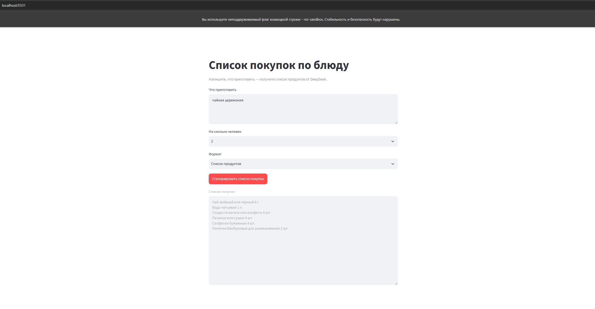
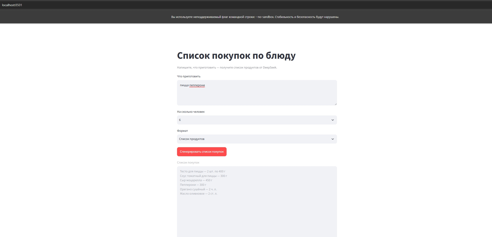
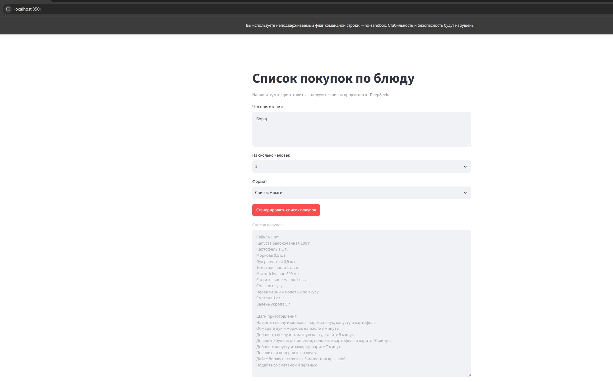
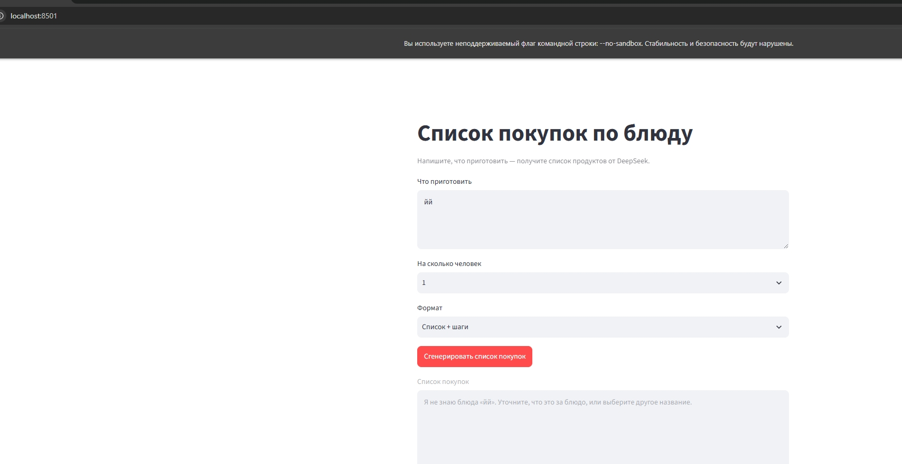
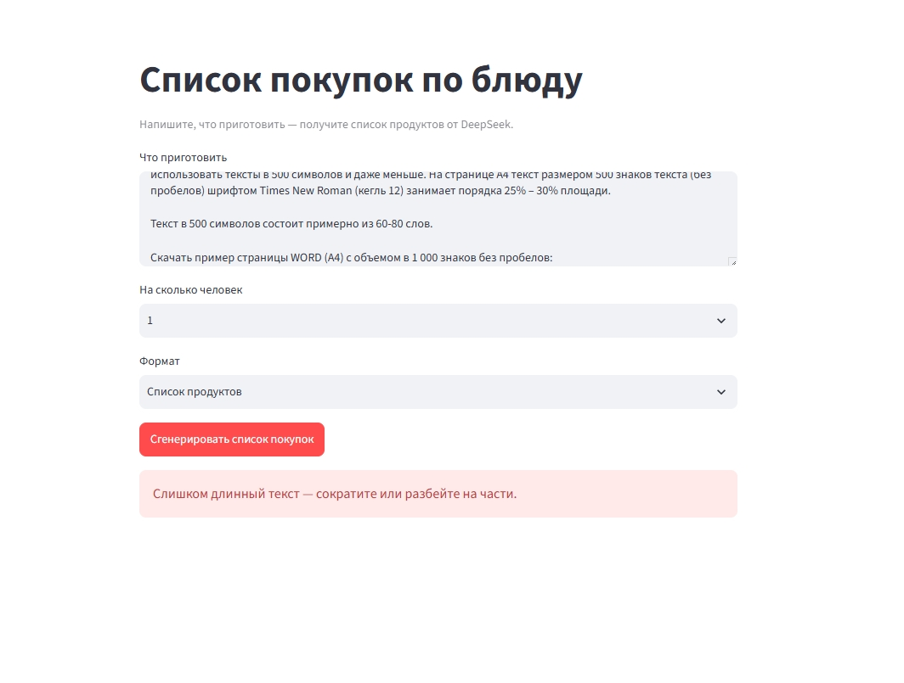

# Список покупок по блюду

Минимальный интерфейс Streamlit: пользователь указывает блюдо, число порций и формат ответа, приложение запрашивает DeepSeek и показывает список покупок.

## Скриншоты

1. 

2. 

3. 

4. [пустое поле](Screenshot_11.jpg)

5. 

6. 